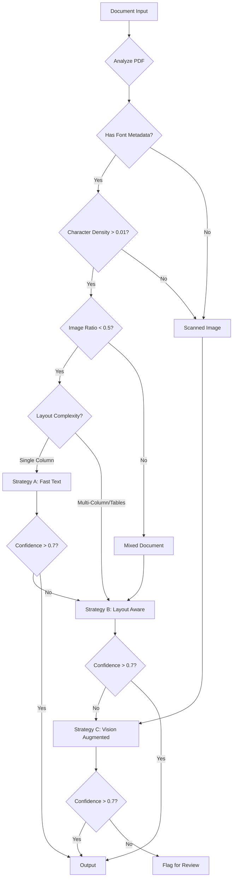

# Domain Notes: Document Intelligence Refinery

## Phase 0: Domain Onboarding

### 1. Extraction Strategy Decision Tree



### 2. Failure Modes Observed

#### Class A: Native Digital Financial Reports

**Document**: CBE Annual Report 2023-24

**Challenges**:
- Multi-column layouts cause reading order issues
- Financial tables with merged cells lose structure
- Footnotes separated from parent tables
- Cross-references ("see Table 3") not resolved

**Solution**:
- Use layout-aware extraction (Strategy B)
- Implement table boundary detection
- Store footnotes as table metadata
- Build cross-reference resolver

**Confidence Signals**:
- Character density: 0.04-0.06 (good)
- Font metadata: Present
- Image ratio: 0.1-0.3 (acceptable)
- Expected confidence: 0.85+

---

#### Class B: Scanned Government/Legal Documents

**Document**: Audit Report - 2023.pdf

**Challenges**:
- No character stream (pure image)
- OCR quality varies by page
- Handwritten signatures/annotations
- Low contrast scans reduce accuracy
- Table borders not always clear

**Solution**:
- Mandatory vision model (Strategy C)
- Page-by-page quality assessment
- Confidence scoring per page
- Human review flag for low confidence

**Confidence Signals**:
- Character density: <0.001 (triggers vision)
- Font metadata: Absent
- Image ratio: >0.8
- Expected confidence: 0.75-0.85

---

#### Class C: Technical Assessment Reports

**Document**: FTA Performance Survey Final Report 2022

**Challenges**:
- Mixed content: narrative + tables + findings
- Hierarchical section structure (5+ levels)
- Assessment matrices with complex formatting
- Embedded charts and figures
- Long paragraphs need semantic chunking

**Solution**:
- Layout-aware extraction (Strategy B)
- Section hierarchy detection
- Figure-caption binding
- Semantic chunking respecting paragraphs

**Confidence Signals**:
- Character density: 0.03-0.05
- Font metadata: Present
- Table count: 10-20
- Expected confidence: 0.80+

---

#### Class D: Structured Data Reports

**Document**: Ethiopia Tax Expenditure Report 2021-22

**Challenges**:
- Table-heavy (80%+ tables)
- Multi-year fiscal data requires precision
- Numerical accuracy critical
- Category hierarchies in tables
- Currency formatting variations

**Solution**:
- Layout-aware with table focus (Strategy B)
- Numerical validation
- Header-row binding enforcement
- Structured fact extraction to SQL

**Confidence Signals**:
- Character density: 0.02-0.04
- Table count: 20+
- Expected confidence: 0.85+

---

### 3. Confidence Scoring Methodology

#### Multi-Signal Approach

We use 4 independent signals to calculate extraction confidence:

1. **Character Density Signal** (weight: 0.25)
   - High density (>0.01): 0.9
   - Medium (0.005-0.01): 0.6
   - Low (<0.005): 0.3

2. **Font Metadata Signal** (weight: 0.25)
   - Present: 0.95
   - Absent: 0.4

3. **Image Ratio Signal** (weight: 0.25)
   - Low (<0.3): 0.9
   - Medium (0.3-0.6): 0.6
   - High (>0.6): 0.3

4. **Content Extraction Signal** (weight: 0.25)
   - Text blocks extracted: 0.8
   - Tables extracted: +0.1
   - No content: 0.1

**Final Confidence** = Average of all signals

**Escalation Threshold**: 0.7
- Below 0.7 → Automatic escalation to next strategy
- Above 0.7 → Accept extraction

---

### 4. Cost Analysis Framework

#### Strategy Cost Breakdown

| Strategy | Tool | Cost/Page | Latency | Use Case |
|----------|------|-----------|---------|----------|
| A: Fast Text | pdfplumber | $0.001 | 50ms | Native digital, simple |
| B: Layout Aware | Docling/MinerU | $0.01 | 200ms | Multi-column, tables |
| C: Vision | Gemini Flash | $0.02 | 500ms | Scanned, handwritten |

#### Budget Guard Implementation

- **Per-document cap**: $1.00
- **Pre-flight check**: Estimate cost before extraction
- **Escalation cost**: Factor in potential escalation
- **Abort threshold**: Reject if estimated cost > cap

#### Example Cost Calculations

**Document**: 120-page financial report (native digital, table-heavy)
- Initial strategy: Layout Aware (B)
- Cost: 120 pages × $0.01 = $1.20
- **Action**: Proceed (within tolerance)

**Document**: 200-page scanned legal document
- Initial strategy: Vision (C)
- Cost: 200 pages × $0.02 = $4.00
- **Action**: Flag for batch processing or human review

---

### 5. Thresholds & Decision Boundaries

#### Origin Type Detection

```python
# Native Digital
character_density > 0.01 AND
has_font_metadata == True AND
image_ratio < 0.5
→ Confidence: 0.9

# Scanned Image
character_density < 0.005 OR
has_font_metadata == False OR
image_ratio > 0.7
→ Confidence: 0.85

# Mixed
Otherwise
→ Confidence: 0.7
```

#### Layout Complexity Detection

```python
# Single Column
table_count < 3 AND
column_count == 1
→ "single_column"

# Table Heavy
table_count > 10
→ "table_heavy"

# Multi-Column
column_count > 1
→ "multi_column"

# Mixed
Otherwise
→ "mixed"
```

---

### 6. Key Insights

#### 1. Vision vs OCR Decision Boundary

**Use Vision When**:
- Character density < 0.005
- No font metadata
- Handwriting detected
- Low OCR confidence (<0.6)

**Use OCR When**:
- Native digital PDF
- High character density
- Font metadata present

**Cost Tradeoff**: Vision is 20x more expensive but 3x more accurate on scanned docs

#### 2. Escalation Logic is the Engineering Problem

The challenge isn't extraction—it's knowing when to escalate:
- Too aggressive → Unnecessary cost
- Too conservative → Poor quality output

Our approach: Multi-signal confidence with empirical thresholds

#### 3. Spatial Provenance is Non-Negotiable

Every extracted fact must carry:
- Page number
- Bounding box (x0, y0, x1, y1)
- Content hash

This enables:
- Audit trail
- Claim verification
- Visual highlighting in source PDF

---

### 7. Pipeline Diagram

```
┌─────────────────────────────────────────────────────────────┐
│                     INPUT DOCUMENTS                          │
│  PDFs (native + scanned) │ Excel │ Word │ Images            │
└────────────────┬────────────────────────────────────────────┘
                 │
                 ▼
┌─────────────────────────────────────────────────────────────┐
│              STAGE 1: TRIAGE AGENT                           │
│  • Origin type detection (digital/scanned/mixed)             │
│  • Layout complexity (single/multi-column/table-heavy)       │
│  • Domain classification (financial/legal/technical)         │
│  • Cost estimation                                           │
│  Output: DocumentProfile                                     │
└────────────────┬────────────────────────────────────────────┘
                 │
                 ▼
┌─────────────────────────────────────────────────────────────┐
│           STAGE 2: EXTRACTION ROUTER                         │
│  ┌──────────────┐  ┌──────────────┐  ┌──────────────┐      │
│  │  Strategy A  │  │  Strategy B  │  │  Strategy C  │      │
│  │  Fast Text   │  │ Layout Aware │  │   Vision     │      │
│  │  pdfplumber  │  │   Docling    │  │ Gemini Flash │      │
│  └──────┬───────┘  └──────┬───────┘  └──────┬───────┘      │
│         │                  │                  │              │
│         └──────────────────┴──────────────────┘              │
│                            │                                 │
│                  Confidence < 0.7?                           │
│                     │         │                              │
│                    Yes       No                              │
│                     │         │                              │
│                 Escalate   Accept                            │
│  Output: ExtractedDocument + Confidence                      │
└────────────────┬────────────────────────────────────────────┘
                 │
                 ▼
┌─────────────────────────────────────────────────────────────┐
│              EXTRACTION LEDGER                               │
│  • Strategy used                                             │
│  • Confidence score                                          │
│  • Cost estimate                                             │
│  • Processing time                                           │
│  • Escalation triggered?                                     │
└─────────────────────────────────────────────────────────────┘
```

---

### 8. Lessons from MinerU Architecture

**Key Takeaway**: Use specialized models, not one general model

MinerU Pipeline:
1. PDF-Extract-Kit → Extract raw content
2. Layout Detection → Identify regions (text/table/figure)
3. Formula Recognition → Specialized OCR for equations
4. Table Recognition → Specialized parser for tables
5. Markdown Export → Unified output format

**Our Adaptation**:
- Strategy A = Fast extraction (pdfplumber)
- Strategy B = Layout detection (Docling)
- Strategy C = Vision understanding (VLM)
- Unified output = ExtractedDocument schema

---

### 9. Next Steps (Phase 3-4)

1. **Semantic Chunking Engine**
   - Implement 5 chunking rules
   - Build ChunkValidator
   - Generate content hashes

2. **PageIndex Builder**
   - Section hierarchy detection
   - LLM-generated summaries
   - Navigation tree construction

3. **Query Interface Agent**
   - LangGraph orchestration
   - 3-tool system (navigate/search/query)
   - Provenance chain generation

---

## References

- MinerU: https://github.com/opendatalab/MinerU
- Docling: https://github.com/DS4SD/docling
- PageIndex: https://github.com/VectifyAI/PageIndex
- Chunkr: https://github.com/lumina-ai-inc/chunkr
